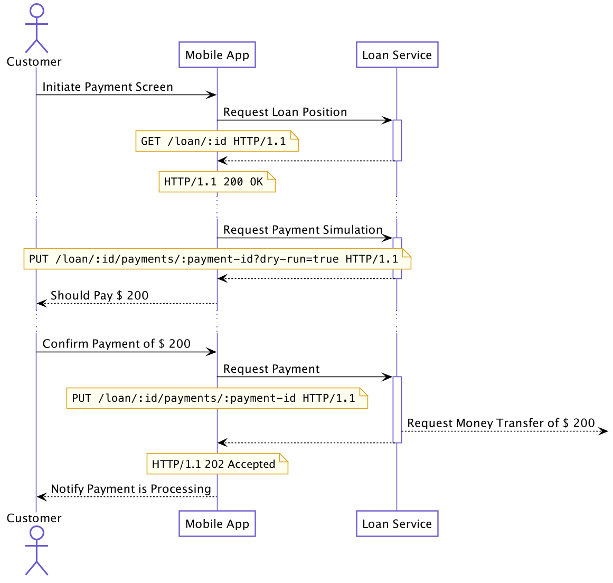
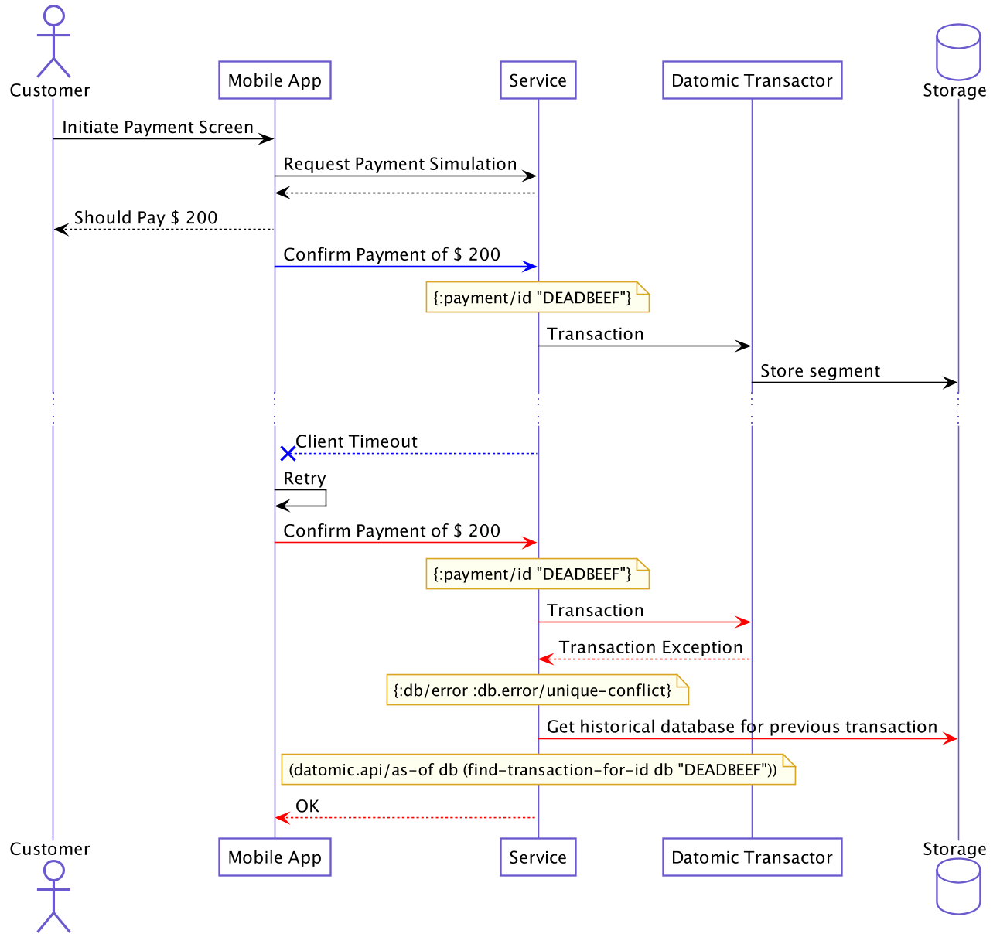

# [fit] Modeling core financial domains with
# [fit] RESTful + CQRS at Nubank

^ In this talk you’ll see:
- How we use Clojure’s persistent data structures to compute complex domain models in-memory
- How we use Datomic’s flexible data shaping to store the appropriate level of detail for different use cases
- How we implement idempotent REST API updates using Datomic’s append-only database
- How we implement aggregate versioning using Datomic’s Compare-and-Set and exposing thru HTTP headers

---

# [fit] Chapter 1: Domain

> Avoiding Objects, using Values[^1]

---

# [fit] Introduction: What is a loan?

> A loan is the lending of money (...)
> The borrower incurs a debt, and is usually liable to pay interest on that debt until it is repaid, and also to repay the principal amount borrowed.[^0]

- What we do at Nubank
- We better get this right :)


^ One of the core activities in Nubank is lending people money through loan contracts. Conceptually straightforward: Money + Time => interest. In practice, it gets a bit more complicated since its a regulated industry with lots of people involved

---

# [fit] Idea: Use Business Language

> A language structured around the **domain model** and **used by all team members** to connect all the activities of the team with the software.[^2]

^ Any problem with a handful amount of people involved, it's reasonable to ensure folks are speaking the same language/concepts. Different actors requires different information resolution. (e.g: Profit and Losses is not relevant for the end customer, but for it's critical for who is running the Business )

---


---

# What is a loan?

- Principal ($)
- Interest Rate (%)
- Late Fee (%)
- Maturity (Date)
- Payment schedule (Bullet, Straight-line, Constant Amortization, ...)
- Purpose (Credit Card, Personal Loan, Mortgage, ...)

---

# What is a loan?

```clojure
#:loan{:id                    UUID
       :type                  #{:loan.type/personal, :loan.type/credit-card, :loan.type/mortgage, #_...}
       :amortization-schedule #{:loan.amortization-schedule/bullet, :loan.amortization-schedule/price, #_...}
       :installments          Integer
       :contract-date         LocalDate
       :interest-rate         BigDecimal
       :late-interest-rate    BigDecimal
       :late-fee              BigDecimal
       ; ...
       }
```

- Not a class, not an object
- No *behaviour* implied, no *state*
- Just data

^ This is what we get from Transposing the relevant facts of a Loan Contract to a Clojure Data Structure. For those not familiar with the language this is a map. Similar usage to Python/Ruby's but its internals are quite different. More on that later

---

# [fit] What can *happen* to a loan?

- Payment
- Late payment
- Anticipation
- Renegotiation
- Cancellation
- "Write-off" (credit default, fraud, ...)

^ Facts alone are just plain data. A Loan is something quite dynamic with plenty of transitions depending on how and when something happened. Debugging and tracking what happened (specially on longer period debts) can become tricky.

---

# [fit] Idea: Event Sourcing


> Capture all **changes** to an application state as a **sequence of events**. [^5]

---

# What can *happen* to a loan?

```clojure
#:loan-event{:id               UUID
             :type             #{:loan-event.type/payment,
             	                 :loan-event.type/late,
             	                 :loan-event.type/anticipation, #_...}
             :reference-date   LocalDate
             :sort-order       Integer
             :disbursement     BigDecimal
             :discount         BigDecimal
             :interest         BigDecimal
             :late-fee         BigDecimal
             :late-interest    BigDecimal
             ; ...
             }
```

- Remember *what* happened, not the interpretation
- Explicit date to be relevant, ordered
- Can be stored, queued, logged...

---

# What can *happen* to a loan?

```
(handle-event initial-view issue-event) => view'

(handle-event view' payment-event) => view''

(reduce handle-event initial-view [event ...]) => view''
```

- Rely on *pure functions* and *higher-order functions*
- Focus on computation rather than updating objects
- Easy to *observe*, *test*

---

# What can *happen* to a loan?

```clojure
(defmethod snapshot-after :loan-event.type/due-payment
  [snapshot-before new-event]
  (let [#_...compute a lot stuff...]
    (-> snapshot-before
        (assoc :debt-snapshot/pv-without-late pv-at-due-date)
        (assoc :debt-snapshot/next-due-date (some-> next-charge :due-date))
        (assoc :debt-snapshot/accruals accruals-after-event)
        (update :debt-snapshot/past-events conj event)
        (update :debt-snapshot/future-charges (comp vec rest))
        (update :debt-snapshot/paid-charges conj paid-charge))))
```

---


---

# [fit] Idea: Persistent Data Structures [^4]

---


---

## Bonus: easy parallelism


---

# [fit] What *causes* updates to a loan?

- Customer borrows a loan
- Customer requests a payment
- Billing system requests an automatic payment
- Billing system detects the loan is late
- Fraud system detects a fraud

---

# [fit] Idea: Command / Query
# [fit] Responsibility Segregation 

> At its heart is the notion that you can use a **different model** to **update** information than the model you use to **read** information. [^6]

---


---

# What *causes* updates to a loan?

```clojure
#:command{:id                UUID
          :type              #{:command.type/issuance-request,
                               :command.type/payment-request,
                               :command.type/cancellation-request,
                               #_...}
          :requested-at      LocalDateTime
          :processed-at      LocalDateTime
          :reference-date    LocalDate
          :processing-status #{:command.status/accepted, :command.status/ok, :command.status/failed, #_...}}
```

- Remember the *request*, assign a *unique id*
- Track status for *asynchronous* processing
- Can be stored, queued, retried, logged...

---

# [fit] Chapter 2: Flow

> Flows vs. Places [^1]

---

# Practical example:
# [fit] Designing a Payment API

---



---


---

# Idea:
# [fit] Datomic speculative transactions

---


---

# Quick Detour: Datomic's data model

entity | attribute | value | tx
--- | --- | --- | --- | ---

---

# Quick Detour: Datomic's data model

```
[{:name "Jane" :phone "12341234"}]
``` 

entity | attribute | value | tx
--- | --- | --- | --- | ---
customer | name | Jane | 1
customer | phone | 12341234 | 1

---

# Quick Detour: Datomic's data model

```
[{:name "Jane" :phone "912341234"}]
``` 

entity | attribute | value | tx
--- | --- | --- | --- | ---
customer | name | Jane | 1
customer | phone | 12341234 | 1
customer | phone | 912341234 | 2

---

# Quick Detour: Datomic's data model

```
[{:name "Jane" :phone "912341234"}
 {:name "Joe"}]
``` 

entity | attribute | value | tx
--- | --- | --- | --- | ---
customer | name | Jane | 1
customer | phone | 12341234 | 1
customer | phone | 912341234 | 2
customer2 | name| Joe | 3

---

# Datomic speculative transactions

```clojure
(let [events  (command->events command)
	  tx-data (prepare-transaction events)]
	(-> (if dry-run?
			(datomic.api/with db tx-data) ;; applies in-memory
			(datomic.api/transact datomic tx-data)) ;; persists to storage
		(get :db-after) ;; lazy representation of entire db
		(proceed-as-usual)))
```

---

# Datomic speculative transactions

- Database is handled as a (lazy) value
  - Pure functions
- Same code path for simulation or transaction
  - Reduced bugs by avoiding corner cases

---


---

# Problem:
# [fit] Idempotent updates

---


---

# Idea:
# [fit] Datomic's historical database

---

as-of

function
Usage: (as-of db t)
Returns the value of the database as of some point t, inclusive.
t can be a transaction number, transaction ID, or Date. [^11]

---



---

# Problem:
# [fit] Concurrent updates

---


---

### Quick detour: Datomic's architecture


---

# Quick detour: Datomic's architecture

- High-availability for reads
  - Cache locality
  - Cache eviction handled for you automagically
  - Optional: Memcached layer
- ACID transactions

---

# Quick detour: Datomic's architecture

- High-availability for reads
  - *Cache locality*
      - Trade-off: *eventually consistent*
  - Cache eviction handled for you automagically
  - Optional: Memcached layer
- ACID transactions

---


---

# Idea:
# [fit] Datomic Transaction Functions &
# HTTP Conditional Headers

---

:db/cas

The *compare-and-swap* function takes four arguments: an entity id, an attribute, an old value, and a new value.

*If the entity has the old value* for attribute, then the *new value will be asserted*.

*Otherwise*, the transaction will *abort* and throw an exception. [^9]

---

If-Match

The *If-Match* HTTP request header makes the request conditional.

For other methods, and in particular for PUT, *If-Match can be used to prevent the lost update problem*. It can check if the modification of a resource that the user wants to upload (*will not override another change that has been done since* the original resource was fetched. If the request cannot be fulfilled, the 412 (Precondition Failed) response is returned. [^10]

---


---

# HTTP <-> Datomic Feature Correspondence

Verb | Req Header | Resp Header | Parameter | Datomic API
--- | --- | --- | --- | ---
GET | - | ETag | - | Historical DB (`as-of`)
PUT | If-Match | - | - | ACID Transactions + Compare-and-Swap (`:db.fn/cas`)
PUT | - | - | dry-run | Virtual transactions (`with`)

---

# [fit] Chapter 3: System

---

# [fit] Introducing: the actors
- Customer: Borrows and pays loans.
- Treasury: Manage cash stock for daily operation.
- Controllership: Reconciliation, incorporate product financials on balance sheet, collect taxes.
- Analysts: Understanding customer, product and portfolio behaviors.
- Regulator: Ensure country-level financial system health.
- Auditor: Cross-check data from different sources.

---


---

# [fit] Idea: Reporting Databases

> The **operational needs** and the **reporting needs** are often quite **different** - with different requirements from a schema and different data access patterns.
> (...)
> It's often a wise idea to separate the reporting needs into a reporting database, which takes a copy of the essential operational data but **represents it in a different schema**. [^7]

---

# Data shapes

desired read shape | Datomic supports via
--- | ---
k/v                | AVET
row                | EAVT
column             | AEVT
document           | EAVT + pull
graph              | VAET

---

# Keeping sanity
- Separate transactional workflows from reporting workflows
	- Denormalized views with the right granularity required by the actors
- Focused core domain services
	- e.g. thin REST API, easy to test
- Auditing is orthogonal
	- Datomic's reified transactions help with that too [^8]

---

# Conclusion

Feature | Ideas
--- | ---
Functional Programming + Values | Use Business Language, Domain Driven Design
Persistent Data Structures | Event Sourcing
Speculative transactions | Command / Query Responsibility Segregation 
Reified Transactions | Orthogonal Audit
Data shapes | Reporting Databases

^ Clojure is a programming language with simplicity as killer feature for modeling complex domains. Its symbiotic relationship with the JVM
allows us to evolve fairly complex systems from simple parts. Paired with a continuous discipline of maintaining cohesion on the system level

----

# Conclusion

 - Know your stakeholders and its timing requirements (real-time vs. batch, sync vs. async, etc)
 - Fight entropy
 - Use separate databases and shapes for reporting
 - Keep tooling simple

^ Clojure is a programming language with simplicity as killer feature for modeling complex domains. Its symbiotic relationship with the JVM
allows us to evolve fairly complex systems from simple parts. Paired with a continuous discipline of maintaining cohesion on the system level

---

> Thank you!

---

Henrique Alves <hcarvalhoalves@gmail.com>
Gustavo Barrancos <gbarrancos@gmail.com>

[^0]: https://en.wikipedia.org/wiki/Loan

[^1]: https://www.youtube.com/watch?v=ROor6_NGIWU

[^2]: https://en.wikipedia.org/wiki/Domain-driven_design

[^3]: https://www.youtube.com/watch?v=ROor6_NGIWU

[^4]: https://www.infoq.com/presentations/Value-Identity-State-Rich-Hickey/

[^5]: https://martinfowler.com/eaaDev/EventSourcing.html

[^6]: https://martinfowler.com/bliki/CQRS.html

[^7]: https://martinfowler.com/bliki/ReportingDatabase.html

[^8]: https://www.youtube.com/watch?v=7lm3K8zVOdY

[^9]: https://docs.datomic.com/cloud/transactions/transaction-functions.html#db-cas

[^10]: https://developer.mozilla.org/en-US/docs/Web/HTTP/Headers/If-Match

[^11]: https://docs.datomic.com/on-prem/clojure/index.html#datomic.api/as-of
